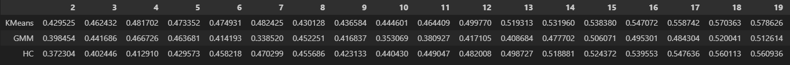

# Insiders - Clustering

### Business Problem
    
- Identify the most valuable clients to create a benefit program
    
### Questions to answer
1. Nomination of people who will be part of the Insiders program

- List: 

|client_id | is_insider |
|:-------:|:---------:|
|10323      |    yes / 1 |
|32413      |    no / 1 |
             
2. Report with business questions:
- Who are the people eligible to participate in the Insiders program?
- How many customers will be part of the group?
- What are the main characteristics of these customers?
- What percentage of revenue is contributed by Insiders?
- What is the expected revenue for this group in the coming months?
- What are the conditions for a person to be eligible for Insiders?
- What are the conditions for a person to be removed from Insiders?
- What is the guarantee that the Insiders program is better than the rest of the base?
- What actions can the marketing team take to increase revenue?

## About the dataset
Sales registers of an e-commerce for one year (11/2015 to 12/2017) 
- Number of rows: 541909 
- Number of columns: 8

## Data Filtering

- Create a missing customer_id dataframe and generate random data starting in the max value of non missinn customer_id;
- Combine this "random customer_id" with the original dataset;
- **unit_price**:  > 0.040
- **stock_code**: not in ['POST', 'D', 'DOT', 'M', 'S', 'AMAZONFEE', 'm', 'DCGSSBOY','DCGSSGIRL', 'PADS', 'B', 'CRUK']
- Eliminate "**description**"
- **country**: not in ['Unspecified','European Community']
- **customer_id**: not in [16446]
- Create a dataframe of purchases: quantity >= 0
- Create a dataframe of returns: quantity <> 0

## Feature Engineering

- Drop columns: `['invoice_no', 'stock_code', 'quantity', 'invoice_date','unit_price', 'country']`
- **gross_revenue**: `quantity x unit_price (all purchases)`
- **monetary**: `aggregate "sum" of gross_revenue`
- **recency**: `aggregate "max" of invoice_date and got the time in days`
- **qtde_invoices**: `count non duplicated 'invoice_no' from purchases`
- **qtde_items**: `aggregated sum of quantity of purchases`
- **qtde_products**: `count of stock_code in purchases`
- **avg_ticket**: `aggregated mean of gross_revenue in purchases`
- **avg_recency_days**: `aggregated mean of non duplicated dates by differences between the purchases of a client`
- **frequency**: `count of non duplicated invoice_no divided by the dys between max and min invoice_date`
- **qtde_returns**: `sum of all quantity per customer in returns`
- **avg_basket_size**: `number of unique invoice_no divided by the sum of all quantity (per client)`
- **avg_unique_basket_size**: `number of unique invoice_no divided by the number of unique stock_code (per client)`

## Pre-Processing

- **MinMaxScaler**: `[gross_revenue, recency_days,qtde_invoices,qtde_items,qtde_products,avg_ticket,avg_recency_days,frequency,qtde_returns,avg_basket_size,avg_unique_basket_size]`

## Feature Selection

- Columns selected: `['customer_id','gross_revenue','recency_days','qtde_products','frequency','qtde_returns']`

## Data Preparation
- Space transformation with: `PCA, T-SNE, UMAP, RandomForestRegressor + UMAP`

- **T-SNE Example**:

## Model

> Tested models: 

- **K-Means**

- **Gaussian Mixture Model** 

- **Hierarchical Clustering**

## Results

- **With T-SNE EMBEDDING**

- **With UMAP EMBEDDING**

- **With TREE-BASED EMBEDDING**

## Model Performance

- Model chosen: **GMM**
- Number of groups: **8**

## Business Performance

| cluster  |  customer_id  |  perc_cluster  |  gross_revenue  |  recency_days  |  qtde_products  |  frequency  |  qtde_returns|
|:--------:|:-------------:|:--------------:|:---------------:|:---------------:|:--------------:|:-----------:|:-----------:|
|6  |  480  |  8.4284  |  8653.0858  |  3.5979	308.9396  |  0.0582  |  99.7750|
|3  |  748  |  13.1343  |  2151.4094  |  14.4920  |  120.3703  |  0.0367  |  26.2353|
|2  |  785  |  13.7840  |  1705.2666  |  41.7962  |  98.8904  |  0.0282  |  14.7019|
|7  |  305  |  5.3556  |  1344.3750  |  85.8361  |  66.1607  |  0.0263  |  7.7902|
|0  |  452  |  7.9368  |  1029.1473  |  20.0088  |  82.7832  |  1.0540  |  1.2987|
|1  |  472  |  8.2880  |  745.2326  |  228.2225  |  44.8051  |  0.4639  |  7.7161|
|4  |  724  |  12.7129  |  728.6587  |  212.0414  |  49.5359  |  1.0068  |  3.7818|
|5  |  1729  |  30.3600	722.0573  |  187.4297  |  55.9740  |  0.9294  |  51.8641|

- Possible nomination:
    - **6**: Cluster Insiders
    - **3**: Cluster More Products
    - **2**: Cluster Spend Money
    - **7**: Cluster Even More Products
    - **0**: Cluster Less Days
    - **1**: Cluster Less 1k
    - **4**: Cluster Stop Returners
    - **5**: Cluster More Buy

